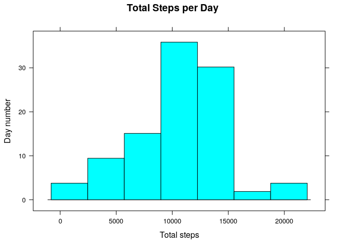

# Reproducible Research: Peer Assessment 1
Fabian Camilo Nieto  
July 12, 2017  

This report is the submition for the course [Reproducible Research](https://www.coursera.org/learn/reproducible-research) project 1 week2.

## First Step Fork/Clone Repository
The [original repository](http://github.com/rdpeng/RepData_PeerAssessment1) was fork in my own repository: [ReproducibleResearchProjectWeek2](https://github.com/fabiancnieto/ReproducibleResearchProjectWeek2)

## Loading and preprocessing the data
The following R additional packages are used:
- dplyr
- lattice

Set the working directory

```r
setwd("/home/fnieto/Documents/R-Programming-Training/datasciencecoursera/Reproducible_Research/Week2/Project")
```
Load the "activity.csv" file into the activityData R object

```r
activityData <- read.csv("activity.csv", stringsAsFactors = FALSE, na.strings = "NA")
activityDf <- tbl_df(activityData)
str(activityDf)
```

```
## Classes 'tbl_df', 'tbl' and 'data.frame':	17568 obs. of  3 variables:
##  $ steps   : int  NA NA NA NA NA NA NA NA NA NA ...
##  $ date    : chr  "2012-10-01" "2012-10-01" "2012-10-01" "2012-10-01" ...
##  $ interval: int  0 5 10 15 20 25 30 35 40 45 ...
```
Notice that the "date" column has chr class, for fix that we should assign the proper class (type of vairable) for "date"

```r
activityDf <- activityDf %>% mutate(date = as.Date(date))
str(activityDf)
```

```
## Classes 'tbl_df', 'tbl' and 'data.frame':	17568 obs. of  3 variables:
##  $ steps   : int  NA NA NA NA NA NA NA NA NA NA ...
##  $ date    : Date, format: "2012-10-01" "2012-10-01" ...
##  $ interval: int  0 5 10 15 20 25 30 35 40 45 ...
```
## What is mean total number of steps taken per day?
Group by the "date" variable the data frame, ignoring the NA values fro the variable "steps"

```r
byDayActivity <- activityDf %>% filter(!is.na(steps)) %>% group_by(date)
stepsByDayActivity <- byDayActivity %>% summarize(stpesByDay = sum(steps))
```
Make a histogram of the total number of the steps take each day

```r
attach(stepsByDayActivity)
histogram(stpesByDay, main="Total Steps per Day", xlab="Total steps", ylab="Day number")
```

<!-- -->
**Mean** and **Median** of the total steps taken per day

```r
byDayActivity %>% summarize(stepsMean = mean(steps), stepsMedian = median(steps))
```

```
## # A tibble: 53 x 3
##          date stepsMean stepsMedian
##        <date>     <dbl>       <dbl>
##  1 2012-10-02   0.43750           0
##  2 2012-10-03  39.41667           0
##  3 2012-10-04  42.06944           0
##  4 2012-10-05  46.15972           0
##  5 2012-10-06  53.54167           0
##  6 2012-10-07  38.24653           0
##  7 2012-10-09  44.48264           0
##  8 2012-10-10  34.37500           0
##  9 2012-10-11  35.77778           0
## 10 2012-10-12  60.35417           0
## # ... with 43 more rows
```

## What is the average daily activity pattern?


## Imputing missing values


## Are there differences in activity patterns between weekdays and weekends?
