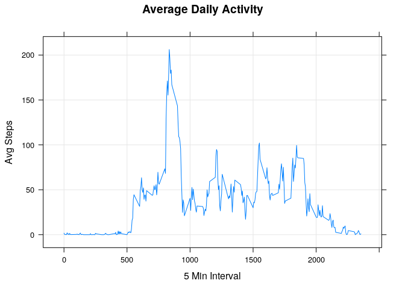
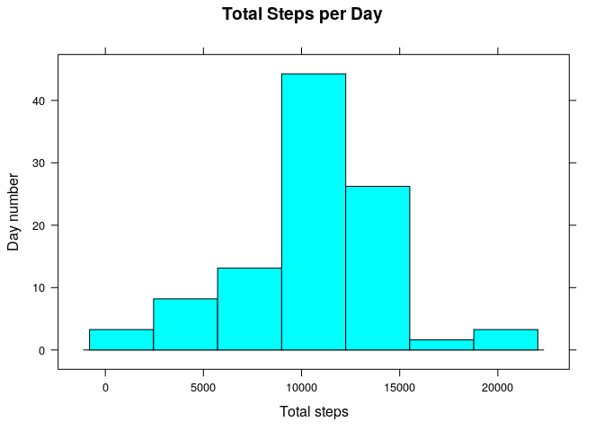
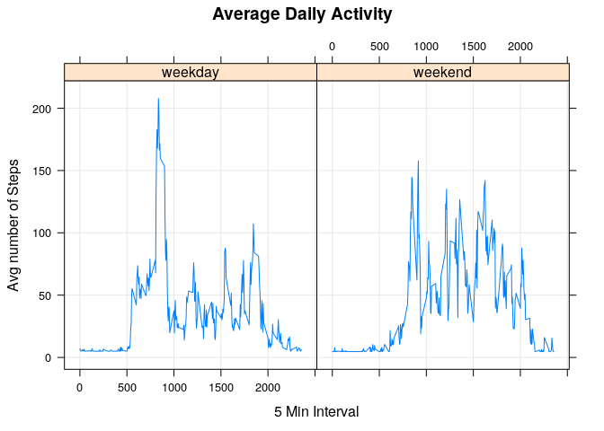

# Reproducible Research: Peer Assessment 1
Fabian Camilo Nieto  
July 12, 2017  

This report is the submition for the course [Reproducible Research](https://www.coursera.org/learn/reproducible-research) project 1 week2.

## First Step Fork/Clone Repository
The [original repository](http://github.com/rdpeng/RepData_PeerAssessment1) was fork in my own repository: [ReproducibleResearchProjectWeek2](https://github.com/fabiancnieto/ReproducibleResearchProjectWeek2)

## Loading and preprocessing the data
The following R additional packages are used:
- dplyr
- lattice

Set the working directory

```r
setwd("/home/fnieto/Documents/R-Programming-Training/datasciencecoursera/Reproducible_Research/Week2/Project")
```
Load the "activity.csv" file into the activityData R object

```r
activityData <-
    read.csv("activity.csv",
    stringsAsFactors = FALSE,
    na.strings = "NA")
    activityDf <- tbl_df(activityData)
    str(activityDf)
```

```
## Classes 'tbl_df', 'tbl' and 'data.frame':	17568 obs. of  3 variables:
##  $ steps   : int  NA NA NA NA NA NA NA NA NA NA ...
##  $ date    : chr  "2012-10-01" "2012-10-01" "2012-10-01" "2012-10-01" ...
##  $ interval: int  0 5 10 15 20 25 30 35 40 45 ...
```
Notice that the "date" column has chr class, for fix that we should assign the proper class (type of vairable) for "date"

```r
activityDf <- activityDf %>% mutate(date = as.Date(date))
str(activityDf)
```

```
## Classes 'tbl_df', 'tbl' and 'data.frame':	17568 obs. of  3 variables:
##  $ steps   : int  NA NA NA NA NA NA NA NA NA NA ...
##  $ date    : Date, format: "2012-10-01" "2012-10-01" ...
##  $ interval: int  0 5 10 15 20 25 30 35 40 45 ...
```
## What is mean total number of steps taken per day?
Group by the "date" variable the data frame, ignoring the NA values for the variable "steps"

```r
byDayActivity <-
    activityDf %>% filter(!is.na(steps)) %>% group_by(date)
stepsByDayActivity <-
    byDayActivity %>% summarize(stepsByDay = sum(steps), meanByDay = mean(steps))
```
Make a histogram of the total number of the steps take each day

```r
attach(stepsByDayActivity)
histogram(stepsByDay,
          main = "Total Steps per Day",
          xlab = "Total steps",
          ylab = "Day number")
```

<!-- -->

**Mean** and **Median** of the total steps taken per day

```r
stepsByDayActivity %>% summarize(Mean = mean(stepsByDay), Median = median(stepsByDay))
```

```
## # A tibble: 1 x 2
##       Mean Median
##      <dbl>  <int>
## 1 10766.19  10765
```

## What is the average daily activity pattern?
Gruop by "interval"" variable and get the mean of the steps per "internal"

```r
by5MinInterval <-
    activityDf %>% filter(!is.na(steps)) %>% group_by(interval) %>% summarize(avgSteps = mean(steps))
by5MinInterval
```

```
## # A tibble: 288 x 2
##    interval  avgSteps
##       <int>     <dbl>
##  1        0 1.7169811
##  2        5 0.3396226
##  3       10 0.1320755
##  4       15 0.1509434
##  5       20 0.0754717
##  6       25 2.0943396
##  7       30 0.5283019
##  8       35 0.8679245
##  9       40 0.0000000
## 10       45 1.4716981
## # ... with 278 more rows
```
Time series plot Average Dailt Activity Pattern

```r
attach(by5MinInterval)
xyplot(
    avgSteps ~ interval,
    main = "Average Daily Activity",
    xlab = "5 Min Interval",
    ylab = "Avg Steps",
    grid = TRUE,
    type = "l"
    )
```

<!-- -->

Maximum number of the steps 5 minute interval 

```r
topInterval <-
    as.character(by5MinInterval %>% arrange(desc(avgSteps)) %>% filter(row_number() == 1) %>% select(interval))
```
Maximum number of the steps 5 minute interval is: 835 => (topInterval)

## Imputing missing values

```r
countNas <-
    as.character(activityDf %>% filter(is.na(steps)) %>% summarize(n()))
```
The total number of missing values are: 2304 => (countNas)

Calculate the mean of the steps

```r
meanStepsByDay <-
    activityDf %>% summarize(meanByDay = mean(steps, na.rm = TRUE))
```

Subset the original data frame with the observations with missing values for steps variable

```r
byDayNas <-
    activityDf %>% filter(is.na(steps)) %>% group_by(date) %>% mutate(steps = (as.numeric(meanStepsByDay)))
```

New data set with missing values filled in mergin the byDayActivity and byDayNas data frames

```r
byDayActivities <-
    rbind(byDayActivity, byDayNas)
dimOriginal <- dim(activityDf)
dimMergeDf <- dim(byDayActivities)
```
The dimension of the original data frame is: **17568, 3** and for the merge data frame is: **17568, 3**

Calculate the total number of steps per day

```r
stepsByDayActivities <-
    byDayActivities %>% summarize(stepsByDay = sum(steps), meanByDay = mean(steps))
```
Make a histogram of the total number of the steps take each day

```r
attach(stepsByDayActivities)
```

```
## The following objects are masked from stepsByDayActivity:
## 
##     date, meanByDay, stepsByDay
```

```r
histogram(stepsByDay,
          main = "Total Steps per Day",
          xlab = "Total steps",
          ylab = "Day number")
```

<!-- -->

**Mean** and **Median** of the total steps taken per day

```r
stepsByDayActivities %>% summarize(Mean = mean(stepsByDay), Median = median(stepsByDay))
```

```
## # A tibble: 1 x 2
##       Mean   Median
##      <dbl>    <dbl>
## 1 10766.19 10766.19
```
Because the number of the observations were increased when added the missing values the total of the steps increased but the mean and median decreased.

## Are there differences in activity patterns between weekdays and weekends?

Create a new factor variable indicating whether a given date is "weekday" or "weekend"

```r
byDayActivities <-
    byDayActivities %>% mutate(weekday = format(date, "%a")) %>%
    mutate(dayType = ifelse((weekday == "Sat" |
    weekday == "Sun"), "weekend", "weekday"))
```
Gruop by "interval"" variable and get the mean of the steps per "internal"

```r
by5MinInterval <-
    byDayActivities %>% group_by(dayType, interval) %>% summarize(avgSteps = mean(steps))
by5MinInterval
```

```
## # A tibble: 576 x 3
## # Groups:   dayType [?]
##    dayType interval avgSteps
##      <chr>    <int>    <dbl>
##  1 weekday        0 7.006569
##  2 weekday        5 5.384347
##  3 weekday       10 5.139902
##  4 weekday       15 5.162124
##  5 weekday       20 5.073235
##  6 weekday       25 6.295458
##  7 weekday       30 5.606569
##  8 weekday       35 6.006569
##  9 weekday       40 4.984347
## 10 weekday       45 6.584347
## # ... with 566 more rows
```
Time series plot Average Daily Activity Pattern

```r
attach(by5MinInterval)
```

```
## The following objects are masked from by5MinInterval (pos = 4):
## 
##     avgSteps, interval
```

```r
xyplot(
    avgSteps ~ interval|dayType,
    main = "Average Daily Activity",
    xlab = "5 Min Interval",
    ylab = "Avg number of Steps",
    grid = TRUE,
    type = "l"
    )
```

<!-- -->
